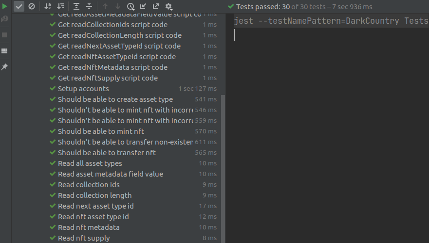

## About
This repository contains unit tests (using [Jest Framework](https://jestjs.io/)) which you can run on Flow Emulator or Flow Testnet.

## Installation

### 1. Install Node

Please follow instructions on NodeJS download page and install [latest version of NodeJS software:](https://nodejs.org/en/download/)

### 2. Install the Flow CLI

Before you start, install the [Flow command-line interface (CLI)](https://docs.onflow.org/flow-cli).

_⚠️ This project requires `flow-cli v0.15.0` or above._

### 3. Flow JS Testing Framework

Run `npm install` inside `test` folder.  

For documentations on how to use
the framework you can consult package repository [https://github.com/onflow/flow-js-testing](https://github.com/onflow/flow-js-testing)

## ✨ Getting Started
### Run tests on Flow Emulator:
1. Run `flow project start-emulator -v` 
2. Run test file

### Run tests on Flow Testnet:
1. Deploy the contracts `flow project deploy --network=testnet`
2. Setup accounts
1. Set contracts address and private keys to environment
2. Run test file

## Final result

